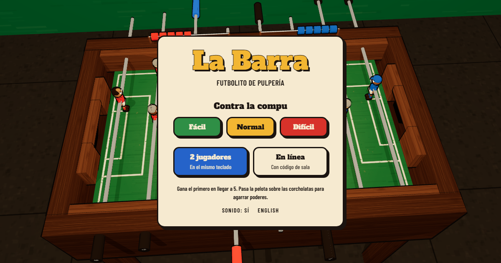

# La Barra

A cartoon table football game for the browser, set in a Honduran corner shop. Atlético La Esquina (red) against Real Pulpería (blue).

**Play:** [la-barra-seven.vercel.app](https://la-barra-seven.vercel.app)



## What's in it

- **Three ways to play.** Against the computer (easy, normal, hard), two players on one keyboard, or online with a four-letter room code.
- **Real physics under the cartoon.** The table, ball and rods are real size (1.20 × 0.68 m field, 35 mm ball) and simulated with Rapier at 480 Hz, so a full-power kick meets the ball instead of passing through it.
- **Arcade on top.** First to five, nine players a side (three in midfield, so there is room to get past it), and passes between rods. Bottle caps drop onto the field with powers (fire, turbo, rust, ice). Don Chepe calls the match from the shop's radio.
- **Options and accessibility.** Volume, picture quality and language; reduced motion, camera shake, three text sizes, high contrast, narrator subtitles and the controls reminder, all remembered in the browser. Every window works from the keyboard, and the two crests differ in shape as well as colour.
- **Everything drawn in code.** Toon shading and ink outlines, seeded players who each look different, the shop wall and its signs, confetti, and every sound synthesized with Web Audio. No models, images or audio files.

## Controls

| | Move | Kick | Pass |
| --- | --- | --- | --- |
| Mouse | Point across the table | Click (hold for power) | Quick right-click |
| Touch | Slide a finger | Tap | Quick two-finger tap |
| Red on the keyboard | W / S | D | A |
| Blue on the keyboard | Arrow up / down | Arrow left | Arrow right |

The rod nearest the ball kicks. A pass rolls the ball to the next rod up, to the teammate with the clearest path; that rod lifts its feet to let it under and traps it. From the forwards, a pass goes sideways to the next forward. Right-drag moves the camera, the wheel zooms.

## How online play works

Peer to peer over WebRTC with PeerJS; its free public broker only introduces the two browsers, and when their networks won't allow a direct link (carrier-grade NAT, mobile data) the traffic goes through Cloudflare's free TURN relay, with short-lived credentials minted by `/api/ice`. The host's browser runs the physics and plays red. The guest plays blue, sends its hand (pointer, keys, kick) and draws what the host sends back 30 times a second, blended 90 ms behind so late packets don't make the ball stutter. No server of our own, nothing to pay for.

## Running it

```sh
npm install
npm run dev     # http://localhost:3000
npm test        # rods, kicks, bot, match rules, power-ups, narrator, netcode
npm run build
```

## Layout

```
src/
  game/    pure rules with tests: table sizes, rods, kick, bot, match, power-ups, narrator
  net/     room codes, snapshot blending, PeerJS session
  scene/   the 3D table, players, ball, lights and effects (React Three Fiber, Rapier)
  ui/      menu, HUD, online lobby, strings in Spanish and English
```

## Stack

Next.js, React Three Fiber, Drei, Rapier, PeerJS, Tailwind CSS. Hosted as a static site.
